# Lagan Codebase Visual Map

This document maps how the repo fits together at runtime. It focuses on the code paths that drive the app experience: auth, habit tracking, progress, leaderboard, AI coaching, reminders, subscriptions, website/admin, and Supabase.

## System Overview

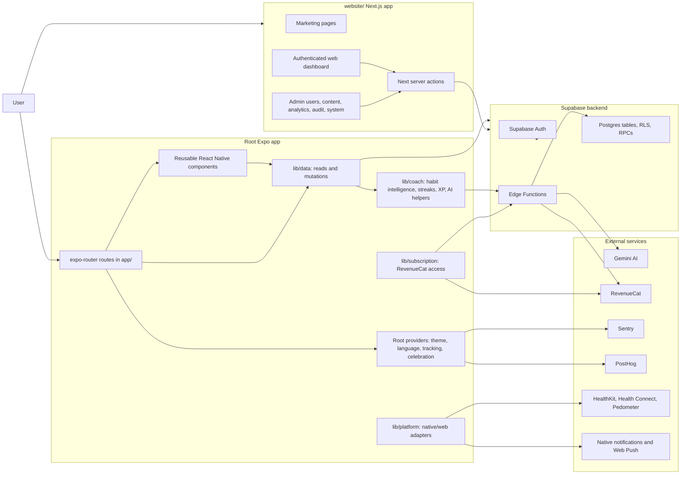

## Main Runtime Surfaces

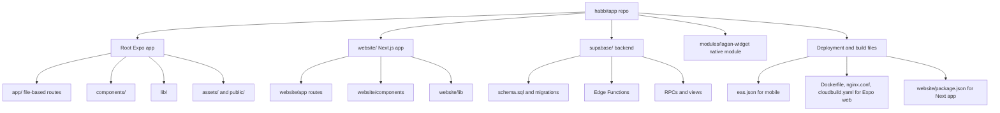

## Expo Route Map

```mermaid
flowchart TB
  Root["app/_layout.tsx"]
  Root --> Public["Public routes"]
  Root --> Tabs["app/(tabs)/_layout.tsx"]
  Root --> HabitStack["Habit modal stack"]
  Root --> Pro["app/pro.tsx"]

  Public --> Login["login.tsx: email, password, Google"]
  Public --> Callback["auth/callback.tsx: OAuth and password reset callback"]
  Public --> Reset["reset-password.tsx"]
  Public --> AccountDeletion["account-deletion.tsx"]

  Tabs --> Today["index.tsx: Today dashboard"]
  Tabs --> Achievements["achievements.tsx: badges, XP, weekly report"]
  Tabs --> Progress["progress.tsx: momentum, consistency, sleep, life balance"]
  Tabs --> Leaderboard["leaderboard.tsx: ranks and opt-in"]
  Tabs --> Settings["settings stack"]

  Settings --> SettingsHome["settings/index.tsx"]
  Settings --> Profile["settings/profile.tsx"]
  Settings --> Reminders["settings/reminders.tsx"]
  Settings --> Coach["settings/coach.tsx"]
  Settings --> Feedback["settings/feedback.tsx"]
  Settings --> Security["settings/security.tsx"]
  Settings --> Privacy["settings/privacy.tsx"]

  HabitStack --> NewHabit["habits/new.tsx"]
  HabitStack --> Wizard["habits/wizard.tsx"]
  HabitStack --> HabitDetail["habits/[id]/index.tsx"]
  HabitStack --> HabitEdit["habits/[id]/edit.tsx"]
```

## App Boot And Auth Flow

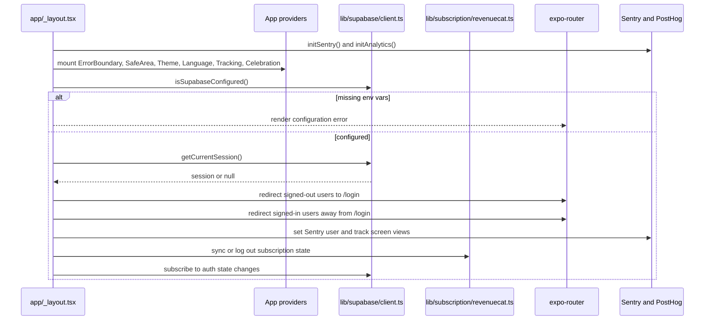

## Today Dashboard Flow

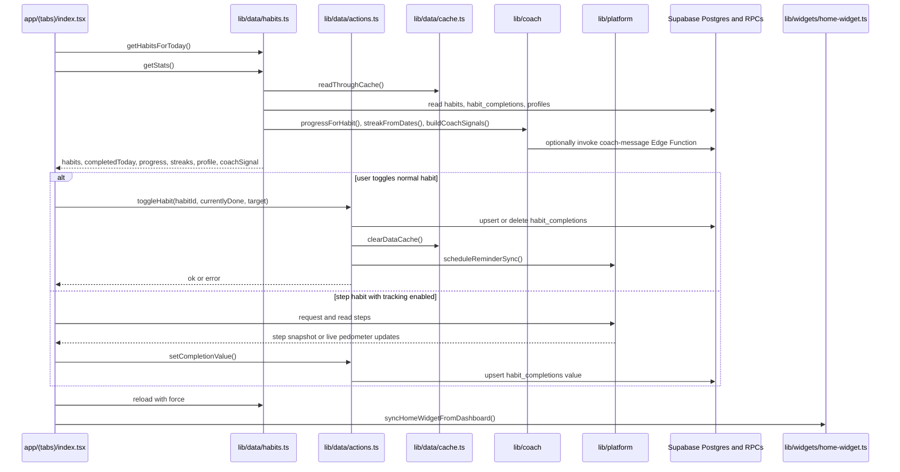

## Habit Creation And AI Routine Flow

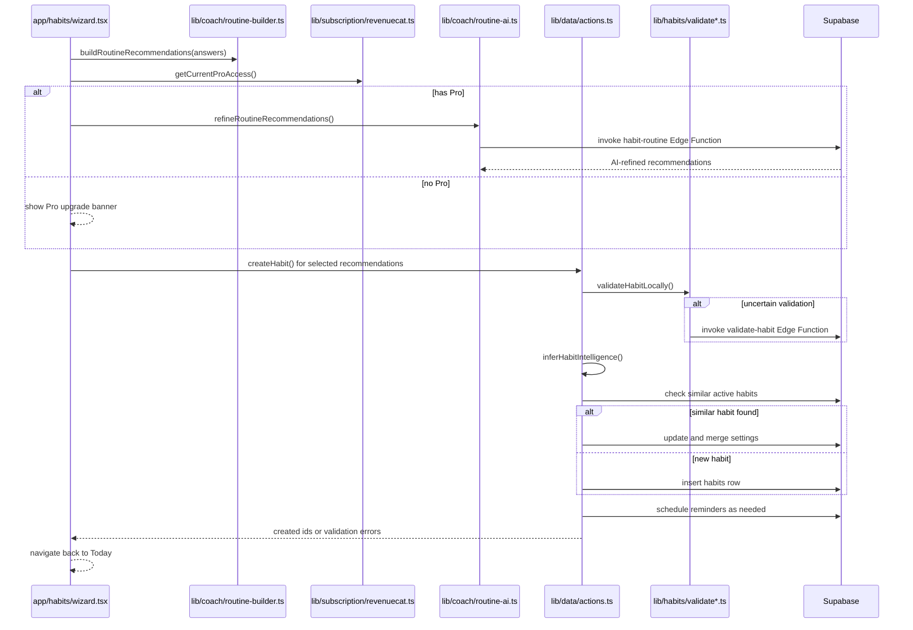

## Feature Flow Map

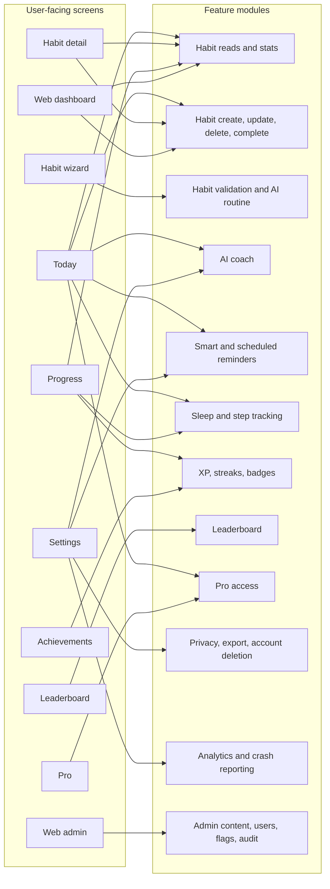

## Supabase Backend Map

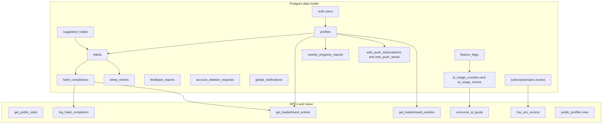

## Edge Functions

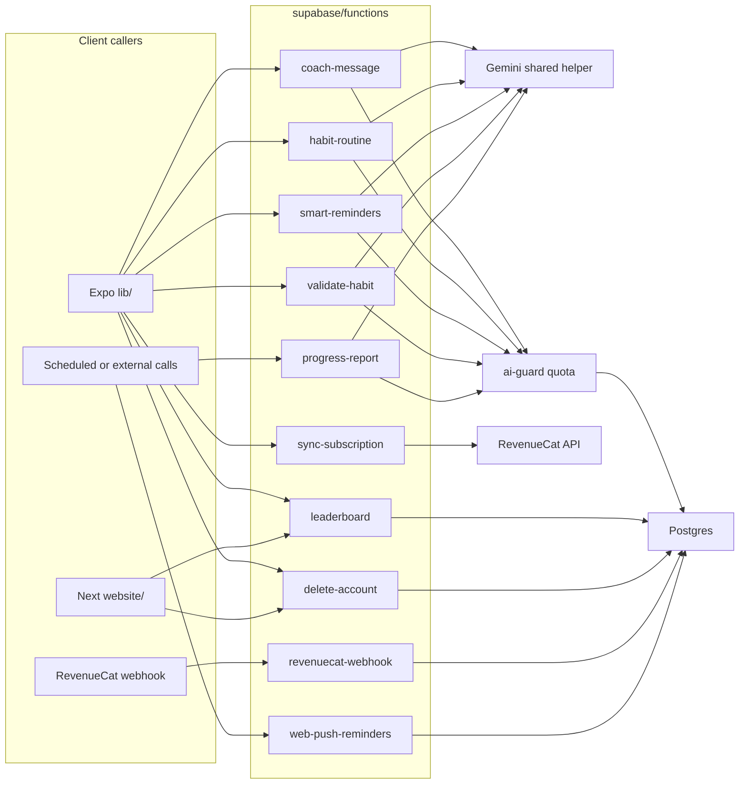

## Website And Admin Flow

```mermaid
flowchart TB
  subgraph PublicWeb["Public website routes"]
    Home["website/app/page.tsx"]
    Login["website/app/login"]
    Privacy["privacy"]
    Terms["terms"]
    AccountDeletion["account-deletion"]
    OG["api/og/card"]
  end

  subgraph AppWeb["Authenticated app routes"]
    Layout["website/app/(app)/layout.tsx"]
    Dashboard["dashboard"]
    WebLeaderboard["leaderboard"]
    WebAchievements["achievements"]
    WebSettings["settings"]
  end

  subgraph AdminWeb["Admin routes"]
    AdminLayout["admin/layout.tsx"]
    Users["admin/users"]
    Content["admin/content"]
    System["admin/system"]
    Analytics["admin/analytics"]
    Audit["admin/audit"]
  end

  subgraph WebLib["website/lib"]
    ServerSupabase["supabase/server.ts"]
    AdminSupabase["supabase/admin.ts"]
    WebHabits["habits.ts"]
    WebStats["stats.ts"]
    AdminAuth["admin/auth.ts"]
    AdminAudit["admin/audit.ts"]
  end

  Home --> WebStats
  Login --> ServerSupabase
  Dashboard --> WebHabits
  Dashboard --> ServerActions["dashboard/actions.ts"]
  WebLeaderboard --> ServerSupabase
  WebSettings --> ServerSupabase
  AdminLayout --> AdminAuth
  Users --> AdminSupabase
  Content --> AdminSupabase
  System --> AdminSupabase
  Analytics --> AdminSupabase
  Audit --> AdminAudit
  ServerSupabase --> Supabase["Supabase Auth and Postgres"]
  AdminSupabase --> Supabase
```

## Platform Adapter Map

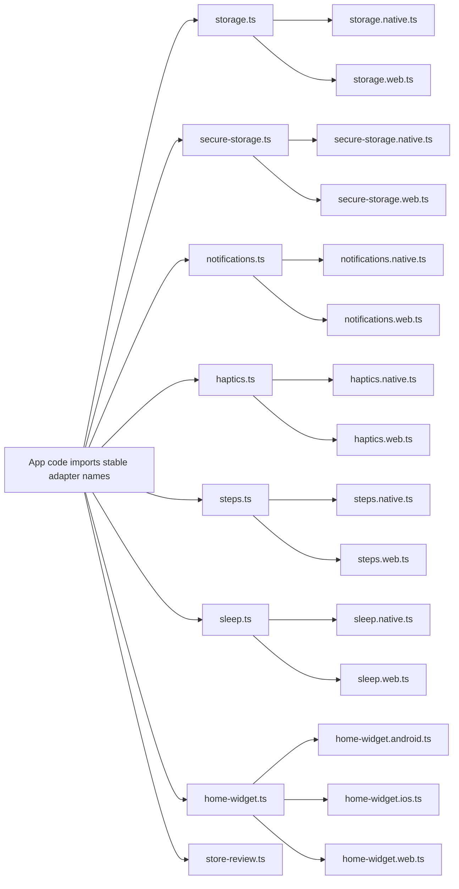

## Feature Inventory

| Feature                  | Entry points                                                  | Core modules                                                                         | Backend                                                     |
| ------------------------ | ------------------------------------------------------------- | ------------------------------------------------------------------------------------ | ----------------------------------------------------------- |
| Authentication           | `app/login.tsx`, `app/auth/callback.tsx`, `website/app/login` | `lib/data/actions.ts`, `lib/supabase/client.ts`, `website/lib/supabase/*`            | Supabase Auth                                               |
| Today habit tracking     | `app/(tabs)/index.tsx`                                        | `lib/data/habits.ts`, `lib/data/actions.ts`, `lib/coach/habit-intelligence.ts`       | `habits`, `habit_completions`, `log_habit_completion`       |
| Habit detail/edit/create | `app/habits/*`                                                | `components/habit-form.tsx`, `lib/data/actions.ts`                                   | `habits`, `habit_completions`                               |
| Routine wizard           | `app/habits/wizard.tsx`                                       | `lib/coach/routine-builder.ts`, `lib/coach/routine-ai.ts`                            | `habit-routine`, `validate-habit`                           |
| AI coach                 | Today screen and coach settings                               | `lib/coach/coach.ts`, `lib/coach/coach-ai.ts`                                        | `coach-message`, AI quota tables                            |
| Progress analytics       | `app/(tabs)/progress.tsx`                                     | `lib/data/habits.ts`, `lib/coach/life-balance.ts`, `lib/data/sleep-data.ts`          | `habit_completions`, `sleep_entries`                        |
| Badges and XP            | `app/(tabs)/achievements.tsx`, website achievements           | `lib/coach/xp.ts`, `lib/coach/badges.ts`, `lib/data/progress-reports.ts`             | `weekly_progress_reports`                                   |
| Leaderboard              | `app/(tabs)/leaderboard.tsx`, website leaderboard             | `lib/data/leaderboard.ts`                                                            | `leaderboard` Edge Function, leaderboard RPCs, `profiles`   |
| Reminders                | Settings reminders, notification scheduler                    | `lib/data/reminders.ts`, `lib/data/reminder-sync.ts`, `lib/coach/smart-reminders.ts` | `smart-reminders`, push tables                              |
| Step tracking            | Today dashboard                                               | `lib/platform/steps.native.ts`, `lib/data/steps-shared.ts`                           | `habit_completions`                                         |
| Sleep tracking           | Progress screen                                               | `lib/platform/sleep.native.ts`, `lib/data/sleep-data.ts`, `lib/data/sleep-shared.ts` | `sleep_entries`, `habit_completions`                        |
| Pro subscription         | `app/pro.tsx`, upgrade banners                                | `lib/subscription/revenuecat.ts`, `lib/subscription/access.ts`                       | `sync-subscription`, `revenuecat-webhook`, `has_pro_access` |
| Privacy and deletion     | settings privacy, account deletion pages                      | `lib/utils/privacy.ts`, `lib/data/actions.ts`                                        | `delete-account`, `account_deletion_requests`               |
| Feedback                 | `app/(tabs)/settings/feedback.tsx`                            | `lib/utils/feedback.ts`                                                              | `feedback_reports`                                          |
| Website dashboard        | `website/app/(app)/dashboard`                                 | `website/lib/habits.ts`, dashboard server action                                     | Supabase server client                                      |
| Website admin            | `website/app/admin/*`                                         | `website/lib/admin/*`, admin server actions                                          | service-role Supabase client                                |
| Observability            | root layout and settings privacy                              | `lib/services/sentry.ts`, `lib/services/analytics.ts`                                | Sentry, PostHog                                             |

## Data Ownership Summary

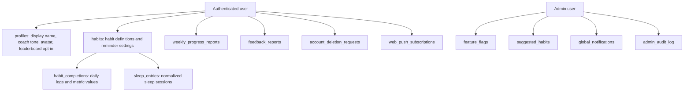

## Build And Deployment Flow

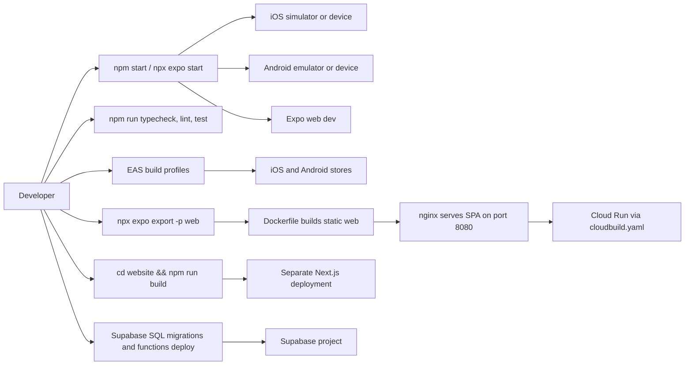
